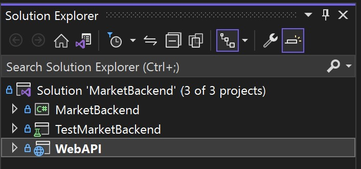

# Workshop-Market

In this project the server is implemented in C# whereas the client is implemented in type-script using react.

## Running the server

- Make sure you have installed:
  - Visual Studio  
  - [.Net Frameowrk 6.0](https://dotnet.microsoft.com/en-us/download/dotnet/6.0)
- Open the [MarketBackend](Server/MarketBackend/MarketBackend.sln) project via Visual Studio as an existing project
- Config the server. See the next section for more details.
- Open the [Solution Explorer](https://docs.microsoft.com/en-us/visualstudio/ide/use-solution-explorer?view=vs-2022) and right-click on the WebAPI project .
- Now select "Set as Startup Project".
- Click the "Run" button at the top of the screen.
- After running the project, a browser page named "Swagger" should open automatically. You can ignore that.

## Configure the server
For running the server using the WebAPI project, you must config an inital scenario for the market, including the admin's credentials. \
First, go to `Server/MarketBackend/MarketBackend/AppConfig.settings` using the vs editor, and set `RunInitFile = True` and  `initFilePath` to path of scenario configuration file.

### Scenario configuration file
This file should contain use cases for the system initialization. \
The format is _json_ with 2 fields for the admin's credentials, and third field for the use cases. \
The loading process keeps results of the actions in variable environment that can be used later. 
In order to store use case's result, use the sub-field `"Ret"`. \
Please note that arguments for IDs are given as strings but parsed as a referene to var. \
For example, the following initialization (Pseudo-Code):
```python
OpenMarket("u0", "password0")         # admin id is always 0
id1 = Register("u1", "password1")   
Login("u1", "password1")
s1 = OpenNewMarket("id1", "store1")   # "id1" is reference to id1, "store1" is just a string
```
Should be written as: 
```json
{
  "AdminUsername": "u0",
  "AdminPassword": "password0",
  "UseCases": [
    {
      "Username": "u1",
      "Password": "password1",
      "Tag": "Register",
      "Ret": "id1"
    }, 
    {
      "Username": "u1",
      "Password": "password1",
      "Tag": "Login",
      "Ret": "_"
    },
    {
      "UserIdRef": "id1",
      "StoreName": "store1",
      "Tag": "OpenNewStore",
      "Ret": "s1"
    }
  ]
}

```

## Running the client

It will be more comefortable to run the client from Visual Studio Code, but it's not mandatory.

- Make sure you have installed:
  - [npm 8.6.0](https://nodejs.org/en/download/) or higher

- Open a new terminal at [market-client](Client/market-client) directory
- Type "npm-install" or "npm i" and click enter. This will install all the dependencies for the project
- Now type "npm start" and press enter.
 A browser window should open with the url: <http://localhost:3000/>
 (though it's possible that the port 3000 is already in use, in which case the terminal/CMD will ask you if it's ok to choose another port, but that doesn't really matter).
- That's it! the client is running and kicking.

**Notes:**

- To open a new client just enter the same root url in a new tab
(usually: "http://localhost:3000/").
- We recommend you run the server before running the client in order to avoid an unpleasant alerts.
- Another problem that could pop up is that you don't have react installed in your workspace, in this case you can install react simply with [npm install react@latest](https://www.npmjs.com/package/react)

## Running the backend tests

- In order to run the backend tests, the backend directory needs to be opened with Visual Studio, as explained earlier
- Right-click the [TestMarketBackend](Server/MarketBackend/TestMarketBackend) directory in the Solution Explorer and choose "Run Tests".
- The Test Explorer window should open automatically and run the tests.
